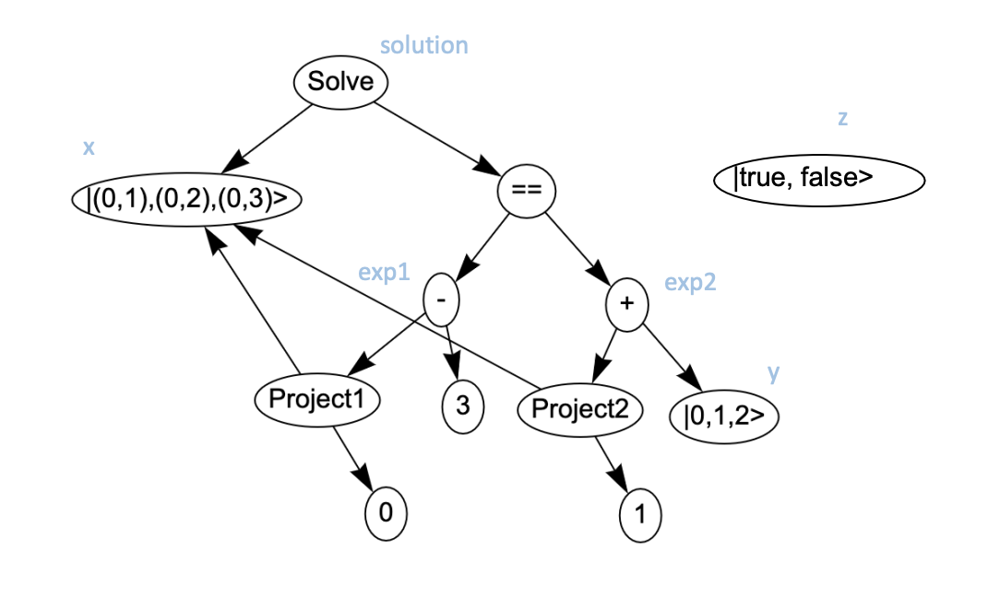

# Aleph

Quantum computers open the possibility of solving some of today's most complex problems. They will  be capable to make calculations that our existing computers take hours, days, or even years, in a small fraction of the time.

Their superpower is not that they are faster or smaller. Their advantage comes from the fact that they can leverage quantum mechanics to perform their calculations.

This superpower comes at a price: instead of Boolean tables quantum algorithms use vectors, matrices and complex numbers to describe the evolution of the system.

Existing quantum programming languages do not offer real abstractions to remove this complexity. Even languages that are explicitly designed to be high-level like [Silq](https://silq.ethz.ch/) or [Q#](https://github.com/microsoft/qsharp-language/tree/main/Specifications/Language) are more reminiscent of Verilog than C#, or even C.

Aleph has a very different approach as it is designed to be a language for large scale hybrid quantum applications, not quantum kernels. Aleph uses only high-level expressions and data types. Like existing high-level classical languages, users don't need to think in terms of circuits or native device instructions. There are no quantum-mechanics concepts in the language and in fact, it can be described using pure classical terms which makes it possible to easyly model, simulate and test small programs. 

Programs in Aleph are not meant to specify individual qubit manipulations, as such they are not capable of many things you can do with a more traditional quantum programming language. In fact, the current operations enable "only" quadratic speed ups compared to their classical counterpart. This is a known limitation that we believe can be overcome by introducing new high-level intrinsic operations (period-finding comes to mind) and by enabling a robust interop interface with other quantum circuits programming languages like Q# or OpenQASM. This features will be implemented in the near future.


## Programming Model: Universes, kets and outcomes


Typically in a programming language an expression takes a single value, for example in the program:
```ocaml
let x = 0
let y = x + 1
```
variable $x$ takes the value 0, and variable $y$ takes the value 1 after evaluating $x + 1$.

Aleph extends this model by allowing expressions to take multiple values simultaneously. This is achieved using a new type of literal, called a Ket and represented with $|\rangle$, which accepts a comma separated list of values with the same type. When a Ket is used in an expression, Aleph will calculate the outcomes for that expression for all the Ket's values, and return the outcomes in a new Ket.
For example in:
```ocaml
let x = |0, 1, 2>
let y = x + 1
```
variable $x$ is a Ket that takes three values: [0, 1, 2], and variable $y$ is also a Ket, calculated by adding 1 to each value of $x$, namely: [0+1, 1+1, 2+1].

When the values of a Ket are calculated from the values of another Ket, we say the two Kets are *entangled*. For example, in the previous example $x$ and $y$ are entangled. When the value of two Kets are calculated independently from each other, we say the Kets are *independent*. For example, two literal Kets are independent.

If two independent Kets are used in an expression, the result is a new Ket that includes a value for each possible combination of the values of the input Kets. For example, in:
```ocaml
let x = |0, 1, 2>
let y = |0, 1, 2>
let z = x + y
```
variable $z$ is calculated from the combination of all $x$ and $y$ values, as such it takes the values [0+0, 0+1, 0+2, 1+0, 1+1, 1+2, 2+0, 2+1, 2+2].

To calculate the results of a Ket expression Aleph prepares a *Universe* that represents all the possible ways the expression can be evaluated. A Universe is a two dimensional matrix in which each column represents the results of an expression, and that contains a row for each possible combination of the values of independent Kets. To build this Universe, Aleph first recursively identifies all independent Kets and generates the table with cartesian product of their values, then it adds a column for the outcome of each entangled expression.

For example, the Universe corresponding to the variable $z$ in the previous program is:


| $x$ | $y$ | $z$ |
| --- | --- | --- |
|  0  |  0  |  0  |
|  0  |  1  |  1  |
|  0  |  2  |  2  |
|  1  |  0  |  1  |
|  1  |  1  |  2  |
|  1  |  2  |  3  |
|  2  |  0  |  2  |
|  2  |  1  |  3  |
|  2  |  2  |  4  |

All Ket expressions are applied to the Ket as a whole, i.e. it is not possible to apply an expression to a subset of its values. However, it is possible to extract a single value from a Ket by first preparing and then measuring its corresponding Universe using Prepare (\`\`) and Measure (`||`) accordingly. 

When a Universe is measured one of its outcomes is randomly selected and the element corresponding to the prepared Ket is returned as the value. Once a Universe is measured its internal state is collapsed and measuring it again always selects the same outcome. To extract a different Ket value, a new Universe must be prepared and measured. For example, in:
```ocaml
let x = |0, 1>
let y = |`x`|
```
variable $y$ takes a single value, 0 or 1, that is randomly selected from the Universe prepared from the variable $x$.


Most of the times, selecting a random value from an entire Universe is not useful; Aleph providers a Filter (`|:`) expression that filters our the rows from a Universe that do not satisfy a given condition condition. To see how this can be useful take the following program that can solve a system of equations. 

```ocaml
let x = |0..8>
let eq1 = x + 3
let eq2 = (1 + 1) * x
let filter = eq1 == eq2
let solution = (x, eq1, eq2) | filter : 1
let y = |`solution`|
```

In this program:

  * In line 1, a Ket is created using a range. Ranges are specified with $a..b$, where $a$ is the first value and $b-1$ is the last. This is stored in variable $x$.
  * In line 2, we create a new Ket by adding to each element of x the classical constant 3 and store the result in variable $eq1$
  * Similarly in line 3, we create a new Ket by multiplying to each element of $x$ with the classical expression $1+1$ and store this in variable $eq2$
  * In line 4, we apply the equal expression $eq1==eq2$ to the Universe containing $eq1$ and $eq2$. On each row of such Universe, Aleph checks if the values of column $eq1$ matches the value of column $eq2$ and reports that in a new column associated with the $filter$ variable.
  * In line 5, the Universe containing $x, eq1, eq2$ is filtered to only those rows where the $filter$ expression is $true$, namely it will to include all rows where $eq1 == eq2$, filter expects a heauristic with the number of columns expected to satisfy the condition, in this case 1. This expression is stored in variable $solution$.
  * In the last line, we return the value of preparing the `solution` Ket and sample it.


The Universe required to calculate $filter$ is listed below. Notice all Kets needed to calculate the expression and their values are included in the Universe. Sampling this Universe would return any of these rows at random. 

| x   |     | eq1 |     | eq2 | filter |
|:---:|:---:|:---:|:---:|:---:|:---:|
| $\mid0..8\rangle$ | 3 | $x+3$ | 1 + 1 | (1+1) * x | eq1 == eq2 |
| 0 | 3 | 3 | 2 | 0 | false |
| 1 | 3 | 4 | 2 | 2 | false |
| 2 | 3 | 5 | 2 | 4 | false |
| 3 | 3 | 6 | 2 | 6 | true |
| 4 | 3 | 7 | 2 | 8 | false |
| 5 | 3 | 8 | 2 | 10 | false |
| 6 | 3 | 9 | 2 | 12 | false |
| 7 | 3 | 10 | 2 | 14 | false |

However, applying the filter expression returns the Universe in which all rows that do not satisfy the filter expression are removed, so only one row remains: $(3, 3, 6, 2, 6, true)$; which implies that when we sample from this Universe the same row is selected we always get a single $(3,3,6)$ value.

| x   |     | eq1 |     | eq2 | filter |
|:---:|:---:|:---:|:---:|:---:|:---:|
| $\mid0..8\rangle$ | 3 | $x+3$ | 1 + 1 | (1+1) * x | eq1 == eq2 |
| 3 | 3 | 6 | 2 | 6 | true |

# Aleph syntax

## Quantum Literals

Quantum literals are created between the `|` `>` symbols. There are two type of values: `int` and `bool`. A simple one-column quantum universe can be created by listing all the possible outcomes, as a basic example:

```fsharp
|0>
```

| |
| --- |
| 0 |

creates a one-column, one row universe that when sampled always has outcome 0.

Multiple element can be specified using a comma to separate them, for example:

```fsharp
|2,4,6,10>
```

creates a one-column, four rows universe that when sampled can give 2, 4, 6 or 10 as outcome, each one with same probability:

| |
| --- |
| 2 |
| 4 |
| 6 |
| 10 |

Multi-column universes can be created using `tuples`. Each `tuple` represents a row of the universe in which each element represents a value for the corresponding register. For example:

```fsharp
| (0,0,0,0), (0,1,1,0), (1,1,0,0) >
```

Creates a 4 columns, 3 rows universe:

|  |  |  |  |
| --- | --- | --- | --- |
| 0 | 0 | 0 | 0 |
| 0 | 1 | 1 | 0 |
| 1 | 1 | 0 | 0 |

Tuples can mix data-types, however all values on a given column must have the same type. This is a valid literal:

```fsharp
| (0,0,false), (0,1,true), (1,1,true) >
```

that creates a 3 columns, 2 rows universe:

|  |  |  |
| --- | --- | --- |
| 0 | 0 | false |
| 1 | 1 | true |
| 0 | 1 | true |

Aleph supports a special type of `int` registers: `@` (all):

```fsharp
| @, size >
```

An `@` int register is one that contains all possible integer values from 0 to 2^size - 1 :

| |
| --- |
| 0 |
| 1 |
| 2 |
| ... |
| 2^size - 1 |


## Quantum Expressions

Each quantum expression modifies a quantum universe and returns a `ket`, i.e. a set of columns from the corresponding quantum universe, with the result of the expression.

### Literals 

A literal expression adds new registers to a quantum universe and returns the corresponding new columns. The values are added using the cross product of all the existing rows in the universe with the elements of the literal. For example, adding:

```fsharp
| (0, true), (1, false) >
```

to the universe:

|  |  |  |  |
| --- | --- | --- | --- |
| 0 | 0 | 0 | 0 |
| 0 | 1 | 1 | 0 |
| 1 | 1 | 0 | 0 |

prepares the universe:

|  |  |  |  | r_0 | r_1|
| --- | --- | --- | --- | --- | --- |
| 0 | 0 | 0 | 0 | 0 | true |
| 0 | 1 | 1 | 0 | 0 | true |
| 1 | 1 | 0 | 0 | 0 | true |
| 0 | 0 | 0 | 0 | 1 | false |
| 0 | 1 | 1 | 0 | 1 | false |
| 1 | 1 | 0 | 0 | 1 | false |

and returns the last two columns.


### Project 

> `ket.idx`


Receives a `ket` and an index, and returns a new ket pointing to the column given the corresponding index in the source ket. For example, in:

```fsharp
let k1 = | (0,0,0), (0,1,1), (1,1,0) > 
let k2 = k1.0
let k3 = k1.1
```

a single universe of 3 columns is prepared for `k1`; `k2` would be a reference to the first column of this universe, and `k3` to the second column.

| k1_0<br>k2_0<br>- | k1_1<br>-<br>k3_0 | k1_2<br>-<br>- |
| --- | --- | --- |
| 0 | 0 | 0 | 0 |
| 0 | 1 | 1 | 0 |
| 1 | 1 | 0 | 0 |

### Join

> `(k1, k2)`

Join takes two kets, and returns a new ket comprised of the union of the columns in the arguments. For example, given:

```fsharp
let k1 = | (0, 0), (1, 1) > 
let k2 = | true, false >
let k3 = (k1, k2)
```

preparing the universe for `k3` would result in:

| k1_0<br>-<br>k3_0 | k1_1<br>-<br>k3_1 | -<br>k2<br>k3_2 |
| --- | --- | --- |
| 0 | 0 | true | 
| 0 | 0 | false |
| 1 | 1 | true |
| 1 | 1 | false |

### Ket\<int> Expressions

> Note: As opposed to classical computers that would normally have to calculate the result of the expression and store the value of each row, a quantum computer stores all the values in a single register in **superposition** and it's capable of calculating the result of the expression for all rows in a single step by leveraging  **quantum parallelism**.

> * Add (`k1 + k2`)
> * Multiply (`k1 * k2`)
> * Equals (`k1 == k2`)

These expressions take two one-column `ket<int>` expressions and add a column to the universe with the result of the corresponding operation, returning the new column. For example, in this program:

```fsharp
let k1 = | (0,0), (0,1), (1,1) > 
let k2 = k1.0
let k3 = k1.1
k2 + k3
```

prepares the following universe and returns the last column:

| k1_0<br>k2<br>- | k1_1<br>k3<br>- | -<br>-<br>r_0 |
| --- | --- | --- |
| 0 | 0 | 0 |
| 0 | 1 | 1 |
| 1 | 1 | 2 |

Similarly this program:

```fsharp
let k5 = | 0, 1 > 
let k6 = | 0, 1 >
k5 == k6
```

prepares the following universe and returns the last column:

| k5<br>-<br>-  | -<br>k6<br>-  | -<br>-<br>r_0 |
| --- | --- | --- |
| 0 | 0 | true |
| 0 | 1 | false |
| 1 | 0 | false |
| 1 | 1 | true |

### Ket\<bool> Expressions

> * And (`k1 and k2`)
> * Or (`k1 or k2`)
> * Not (`not k1`)

Similar to `ket<int>`, these expressions take one or two one-column `ket<bool>` expressions and add a column to the universe with the result of the corresponding operation, returning the new column.

### If/Else

> `if ket<bool> then ket<T'> else ket<T'> : T'`

A quantum `if` expression, takes a boolean `ket` for condition and two ket expressions of matching type. It adds four new columns to the quantum universe as it evaluates all the input expressions: the `condition`, the `then` and the `else`, then it populates the last column based on the value of the condition column: if the condition expression it takes the `then` column, otherwise it takes the `else` column. It returns the last column.

For example:
```
let x = | 0,1,2,3 >
if x == 2 then 10 else f20
```

prepares the following universe and returns the last column:

| x<br>-<br>-  | -<br>x == 2<br>- | -<br>10<br>- | -<br>20<br>- | -<br>-<br>r_0 |
| --- | --- | --- | --- | --- | 
| 0 | false | 10 | 20 | 10 |
| 1 | false | 10 | 20 | 10 |
| 2 | true  | 10 | 20 | 20 |
| 3 | false | 10 | 20 | 10 |


### Solve

> `Solve (ket<T'>, ket<bool>) : ket<T'>`

Solve takes a `ket` and a `bool quantum expression` and returns a ket from a universe that is equal to the universe of the input ket, with all the rows filtered to only those that satisfy the boolean expression. It returns the same columns as those from the input ket.

For example:

```fsharp
let k1 = | (0,0,0), (0,0,1), (0,1,0), (0,1,1), (1,0,0), (1,0,1) > 
let k2 = k1.0 + k1.2
let k3 = Solve ( (k1.0, k1.2), k2 == |1>)
```

creates the following universe for k3:

| k1_0<br>k3_0 | k1_1<br>- | k1_2<br>k3_1 | k2_0 | \|1\> | k2 == \|1\> |
| --- | --- | --- | --- | --- | --- |
| 0 | 0 | 1 | 1 | 1 | true |
| 0 | 1 | 1 | 1 | 1 | true |
| 1 | 0 | 0 | 1 | 1 | true |

* k1 is the source for the first 3 columns.
* k2 (adding columns 0 and 2) is the source of the next column.
* the literal `|1>` is the source of the next column
* the `==` in the predicate is the source of the last column

> **Note 1:** to filter such a table on a classical computer requires iterating through all the rows. On a quantum computer the number of operations depend on the number of columns when using **amplitude amplification**.


## Prepare, sample, estimate

In Aleph, the entire quantum program forms a single direct acyclical graph (DAG). Each quantum expression is a node in the DAG and edges connects each expression with its inputs. A quantum variable is just a label for the corresponding node. For example:

```
let x = |(0,1), (0,2), (0,3)>
let y = |0,1,2>
let z = |true, false>
let exp1 = 3 - x.0
let exp2 = y + x.1
let solution = Solve(x, exp1 == exp2)
```

generates this graph:



### Prepare

> `Prepare (ket<T'>) : universe<T'>`

The `Prepare` method takes *any* node on the graph and prepares the minimum quantum universe needed to calculate it by recursively traversing every parent in the graph. Nodes are evaluated only once even if the node has multiple input edges.

Prepare returns a quantum universe, whose value type matches the type of the input ket.


### Sample

> `| universe<T'> | : T'`

Sample accepts a universe and returns the value for one of the rows it picks at random. For example:

```
let x = | 1, 2, 3, 4 >
| Prepare(x) |
```

will randomly return a value between 1 and 4.

> **Note:**  `Prepare` can also accept a `Ket` as input, in which case `Prepare` is implicitly called.

**A universe can only be sampled once**. One the universe is sampled its state is destroyed and cannot be used again. To get a different sample, a new universe must be prepared.

**Sample always return a value**, even if the resulting universe is empty. Even more, it might also return a wrong value: since quantum algorithms are probabilistic in nature, it is good practice to trust, but verify the answer of the computation.

### Estimate

> `Estimate (universe<bool>, int) : int`

Estimate returns an estimated number of times a `true` row will be selected for `n` tries.

For example:

```fsharp
let k1 = | (0,0,0), (0,0,1), (0,1,0), (0,1,1), (1,0,0), (1,0,1) > 
let k2 = k1.0 + k1.2
let u = Prepare( k2 == |1> )
Estimate (u, 1000)
```

returns 500

> **Note:** For datasets with large number of elements, Monte Carlo is a common method to calculate the estimated value of a variable, using **amplitude estimation** it is possible to get a quadratic speed up for the same task.

## Classic & mixed expressions

Aleph supports a similar set of expressions for classical values.

* Literals
    * **int**
    * **bool**
    * **tuples**
    * **sets** Similar to `kets`, uses brackets `{}` to differentiate them
    * **ranges**: `start..stop`: shortcut for a set that includes from `start` to `end - 1` 
* Project
* Join
* Unary/Binary expressions
    * **add**
    * **multiply**
    * **equals**
    * **and**
    * **or**
    * **not**
* Set expressions:
    * **element** - picks a random element from a set
    * **append**
    * **remove**
    * **count**
* **if/else**

Classical expressions are evaluated eagerly and their values can be used in quantum expressions. When this happens the result of the expression is first converted into a quantum literal so it can be used in a expression. For example:

```
let x = |1,2,3>
let y = 5 * 2
let z = x + y
```

the expression `5 * 2` is eagerly evaluated and its value assigned to the variable `y`. The expression `x + y` takes both a quantum and a classical value, as such it will first convert the classical value `10` into a quantum literal to evaluate the expression. The quantum universe prepared for `z` is:

| | | z_0 |
| --- | --- | --- |
| 1 | 10 | 11 |
| 2 | 10 | 12 |
| 3 | 10 | 13 |


## Functions

`let name (args) body`

Functions are classical values. They are first class objects, so can be used as arguments for other functions. Their body can include both classical or quantum expressions.


## Examples

### Coin flip

Aleph's most basic program is a  coin flip:

```aleph
let coin = | 1, 0 >
| coin |
```

The first instruction (`|>`) creates a one-column universe of two values, namely: 

| coin |
|-----|
| 0 |
| 1 |

The second instruction (`||`) prepares, samples and returns a value from this quantum universe. In this particular case, since there are only two possible outcomes on the universe (0 or 1), it will return either with the same possibility.


### Rolling two dices

```aleph
let dice1 = | 1..6 >
let dice2 = | 1..6 >

let roll = (dice1, dice2)
| roll |
```

Roll is the join of two quantum literals. Literals are added to a quantum universe via cross product, therefore the corresponding quantum universe for `roll` is `(1,1), (1,2) ...  (6,6)`. As before the last instruction prepares, samples and return a random value from this universe.


### Solving systems of equations

```fsharp
let x = | @, 4 >
let y = | @, 4 >
let eq1 = 4 * x + 5 * y
let eq2 = -6 * x + 20 * y
let solution = Solve ((x, y), eq1 == eq2)
| Prepare (solution) |
```

`x` and `y` are some quantum variables that can take any integer value. `eq1` and `eq2` use these kets to calculate all possible values of their corresponding equations. We then use solve to filter the values to only those in which `eq1 == eq2`.

Preparing a universe for this expression will return only the values where eq1 == eq2. 

### Color graphing

Solves the coloring problem for a graph in which no two adjacent nodes should have the same color.

```fsharp
let RED   = 0
let BLUE  = 1
let GREEN = 2


// A function that return the list of all available colors:
let colors() =
    | RED, BLUE, GREEN >

// Edges are listed classically, so we can iterate through them
let edges = {
  (0, 1),
  (1, 2),
  (3, 1), 
  (2, 0)
}

// checks if the coloring for the nodes x and y is invalid.
// invalid is when the 2 nodes of an edge have the same color.
let is_valid_edge_coloring (color1: ket<int>, color2: ket<int>) =
    color1 != color2

// A valid color combination oracle.
// Returns true only if the nodes' color combination is valid for all edges.
let classify_coloring (edges: Set<Tuple<Int, Int>>, coloring: Ket<Int, Int, Int, Int>) : Ket<Bool> =
    if Count(edges) == 0 then
            | true >
    else
        let e = Element(edges)
        let rest = Remove(e, edges)
        let x = e[0]
        let y = e[1]
        let one = is_valid_edge_coloring (coloring[x], coloring[y]) 
        if Count(rest) == 0 then
            one
        else
            one && classify_coloring(rest, coloring)
        valid


// A ket with the color combination for all nodes. Each node is an item of a tuple.
let nodes_colors = (colors(), colors(), colors(), colors())

// To find a valid coloring, solve the valid_combination oracle and
// measure the result
let classification = classify_coloring (edges, nodes_colors)
let answers = Solve(nodes_colors, classification)
| Prepare (answers) |
```

### Numerical Integration

**TODO...***
